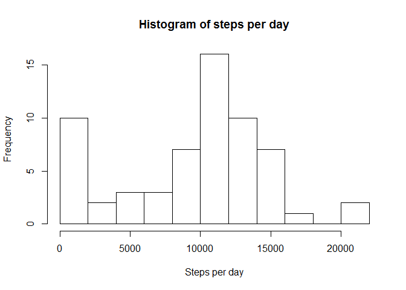

## Loading and preprocessing the data


```r
# Extract data from the archive
if(!file.exists("activity.csv"))
{
  unzip("activity.zip", files = "activity.csv")
}

# Read data from CSV-file
activity <- read.csv("activity.csv", colClasses = c("integer", "character", "integer"))

# Convert data in 'date' column to Date class
activity$date <- as.Date(activity$date, format = "%Y-%m-%d")

# Convert to dplyr table
library(dplyr)
activity <- tbl_df(activity)

summary(activity)
```

```
##      steps             date               interval     
##  Min.   :  0.00   Min.   :2012-10-01   Min.   :   0.0  
##  1st Qu.:  0.00   1st Qu.:2012-10-16   1st Qu.: 588.8  
##  Median :  0.00   Median :2012-10-31   Median :1177.5  
##  Mean   : 37.38   Mean   :2012-10-31   Mean   :1177.5  
##  3rd Qu.: 12.00   3rd Qu.:2012-11-15   3rd Qu.:1766.2  
##  Max.   :806.00   Max.   :2012-11-30   Max.   :2355.0  
##  NA's   :2304
```

## What is mean total number of steps taken per day?

Let's start with plotting histogram of steps taken per day


```r
# Calculate the total number of steps taken per day
stepsPerDay <- activity %>%
  group_by(date) %>%
  summarise(stepsPerDay = sum(steps, na.rm = TRUE))

# Plot histogramm
hist(stepsPerDay$stepsPerDay, 
     breaks = 10,
     xlab = "Steps per day", 
     main = "Histogram of steps per day")
```

<!-- -->


Now let's calculate mean and median of the total number of steps taken per day


```r
print(mean(stepsPerDay$stepsPerDay))
```

```
## [1] 9354.23
```

```r
print(median(stepsPerDay$stepsPerDay))
```

```
## [1] 10395
```


## What is the average daily activity pattern?


## Imputing missing values


## Are there differences in activity patterns between weekdays and weekends?
