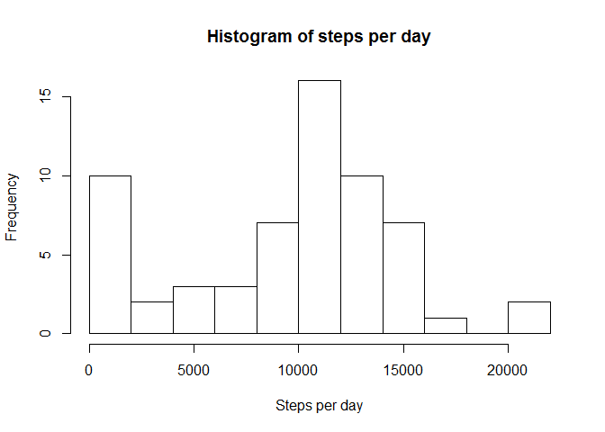
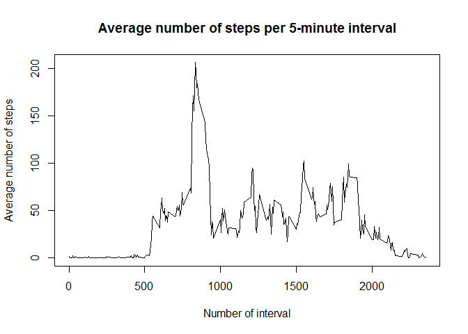
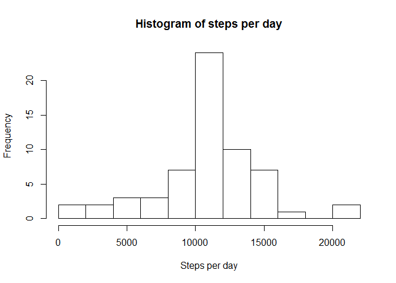
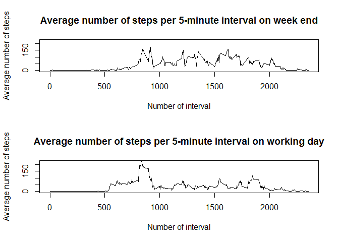

We use dplyr library for processing data:


```r
library(dplyr)
```

## Loading and preprocessing the data


```r
# Extract data from the archive
if(!file.exists("activity.csv"))
{
  unzip("activity.zip", files = "activity.csv")
}

# Read data from CSV-file
activity <- read.csv("activity.csv", colClasses = c("integer", "character", "integer"))

# Convert data in 'date' column to Date class
activity$date <- as.Date(activity$date, format = "%Y-%m-%d")

# Convert to dplyr table
activity <- tbl_df(activity)

summary(activity)
```

```
##      steps             date               interval     
##  Min.   :  0.00   Min.   :2012-10-01   Min.   :   0.0  
##  1st Qu.:  0.00   1st Qu.:2012-10-16   1st Qu.: 588.8  
##  Median :  0.00   Median :2012-10-31   Median :1177.5  
##  Mean   : 37.38   Mean   :2012-10-31   Mean   :1177.5  
##  3rd Qu.: 12.00   3rd Qu.:2012-11-15   3rd Qu.:1766.2  
##  Max.   :806.00   Max.   :2012-11-30   Max.   :2355.0  
##  NA's   :2304
```

## What is mean total number of steps taken per day?

Let's start with plotting histogram of steps taken per day


```r
# Calculate the total number of steps taken per day
stepsPerDay <- activity %>%
  group_by(date) %>%
  summarise(stepsPerDay = sum(steps, na.rm = TRUE))

# Plot histogramm
hist(stepsPerDay$stepsPerDay, 
     breaks = 10,
     xlab = "Steps per day", 
     main = "Histogram of steps per day")
```

<!-- -->


Now let's calculate mean and median of the total number of steps taken per day


```r
mean(stepsPerDay$stepsPerDay)
```

```
## [1] 9354.23
```

```r
median(stepsPerDay$stepsPerDay)
```

```
## [1] 10395
```

## What is the average daily activity pattern?

Now let's calculate average number of steps per interval during a day


```r
stepsPerInterval <- activity %>%
  group_by(interval) %>%
  summarise(averageStepsPerInterval = mean(steps, na.rm = TRUE))
```

Here is the plot of these values:


```r
plot(stepsPerInterval$interval, stepsPerInterval$averageStepsPerInterval, type = "l", xlab = "Number of interval", ylab = "Average number of steps", main = "Average number of steps per 5-minute interval")
```

<!-- -->

Let's find, which 5-minute interval, on average across all the days in the dataset, contains the maximum number of steps:


```r
stepsPerInterval[which.max(stepsPerInterval$averageStepsPerInterval),]$interval
```

```
## [1] 835
```

## Imputing missing values

Here is the total number of missing values in the dataset:


```r
sum(is.na(activity$steps))
```

```
## [1] 2304
```

Now let's replate missing values of steps with average number of steps for the same interval:


```r
# Clone dataset
activityWithoutNA <- activity

# Replace NA with average values
for(index in which(is.na(activityWithoutNA$steps)))
{
  interval <- activityWithoutNA[index,]$interval
  activityWithoutNA[index,]$steps <- stepsPerInterval[stepsPerInterval$interval == interval,]$averageStepsPerInterval
}

summary(activityWithoutNA)
```

```
##      steps             date               interval     
##  Min.   :  0.00   Min.   :2012-10-01   Min.   :   0.0  
##  1st Qu.:  0.00   1st Qu.:2012-10-16   1st Qu.: 588.8  
##  Median :  0.00   Median :2012-10-31   Median :1177.5  
##  Mean   : 37.38   Mean   :2012-10-31   Mean   :1177.5  
##  3rd Qu.: 27.00   3rd Qu.:2012-11-15   3rd Qu.:1766.2  
##  Max.   :806.00   Max.   :2012-11-30   Max.   :2355.0
```

Here is the histogram of of the total number of steps taken each day


```r
# Calculate the total number of steps taken per day
stepsPerDayWithoutNA <- activityWithoutNA %>%
  group_by(date) %>%
  summarise(stepsPerDay = sum(steps, na.rm = TRUE))

# Plot histogramm
hist(stepsPerDayWithoutNA$stepsPerDay, 
     breaks = 10,
     xlab = "Steps per day", 
     main = "Histogram of steps per day")
```

<!-- -->

And here are the mean and median  total number of steps taken per day


```r
mean(stepsPerDayWithoutNA$stepsPerDay)
```

```
## [1] 10766.19
```

```r
median(stepsPerDayWithoutNA$stepsPerDay)
```

```
## [1] 10766.19
```

As you can see, the histograms of the total number of steps taken each day are very similar with missing value and with imputed missing values. The main difference is near 0. All missing values were included in this basket of the histogramm. Now they are distributed across other baskets. This also led to increase of mean and median values of the total number of steps taken each day.

## Are there differences in activity patterns between weekdays and weekends?

Let's add information about weekday:


```r
# Define new field which shows if date is an week end or not.
activityWithWeekDay <- activity %>%
  mutate(wday = recode_factor(as.POSIXlt(date)$wday, 
                          `0` = "weekend", 
                          `1` = "weekday", 
                          `2` = "weekday", 
                          `3` = "weekday", 
                          `4` = "weekday", 
                          `5` = "weekday", 
                          `6` = "weekend"))

# Calculate average steps per interwal on week end
activityOnWeekend <- activityWithWeekDay %>%
  filter(wday == "weekend") %>%
  group_by(interval) %>%
  summarise(averageStepsPerInterval = mean(steps, na.rm = TRUE))

# Calculate average steps per interwal on working days
activityOnWorkDay <- activityWithWeekDay %>%
  filter(wday == "weekday") %>%
  group_by(interval) %>%
  summarise(averageStepsPerInterval = mean(steps, na.rm = TRUE))
```
Now let's plot dependencies of average number of steps by interval


```r
par(mfrow = c(2, 1))

plot(activityOnWeekend$interval, activityOnWeekend$averageStepsPerInterval, 
     type = "l",
     ylim = c(0, 220),
     xlab = "Number of interval", 
     ylab = "Average number of steps", 
     main = "Average number of steps per 5-minute interval on week end")

plot(activityOnWorkDay$interval, activityOnWorkDay$averageStepsPerInterval, 
     type = "l",
     ylim = c(0, 220),
     xlab = "Number of interval", 
     ylab = "Average number of steps", 
     main = "Average number of steps per 5-minute interval on working day")
```

<!-- -->

As you can see, there is a clear distinction between working days and week end. On working days during working hours average number of steps is considerably smaller then on week end. 
